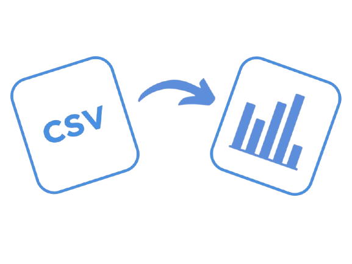

# DataViz: CSV Data Visualizer

DataViz is a modern, interactive web application for visualizing and exploring CSV datasets. Upload your CSV file and instantly get professional, animated charts, PCA, clustering, and correlation heatmaps—all in your browser, no coding required!

## Features

- **Drag-and-drop CSV upload** with animated, user-friendly UI
- **Automatic outlier removal** for cleaner analysis
- **Distribution, box, and bar charts** for each column
- **PCA (Principal Component Analysis)** visualization
- **KMeans clustering** with optimal cluster detection
- **Correlation heatmap** for numeric columns
- **Animated, modern design** with Bootstrap and custom styles
- **Demo video** accessible from a bouncing button in the bottom right

## How It Works

1. **Upload** your CSV file using the drag-and-drop area or file picker.
2. The app **analyzes your data**, removes outliers, and generates insightful visualizations.
3. View:
   - Distributions and box plots for numeric columns
   - Bar and pie charts for categorical columns
   - PCA and clustering plots
   - Correlation heatmap
4. Click the bouncing video button in the bottom right for a quick demo!

## Screenshots

## Demo

Click the bouncing video button in the bottom right of the app, or watch the demo video in `static/demo - data viz.mp4`.
